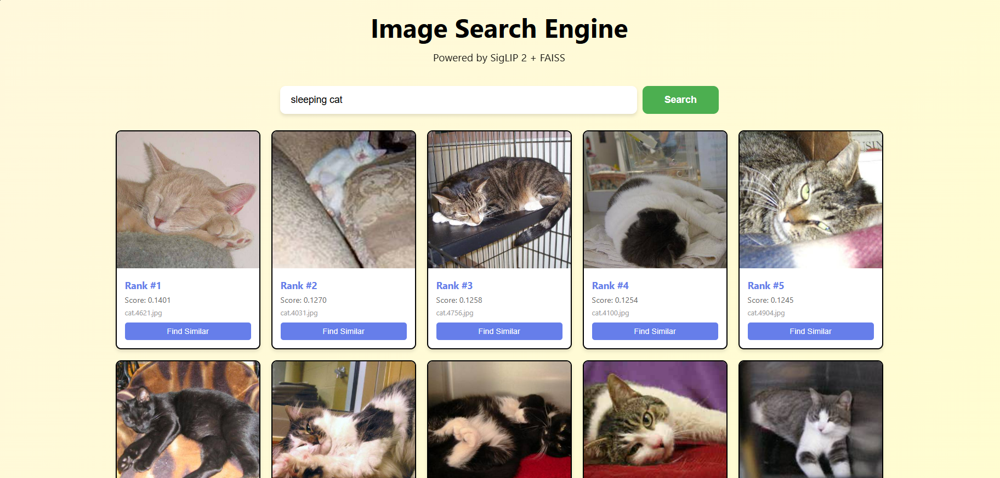
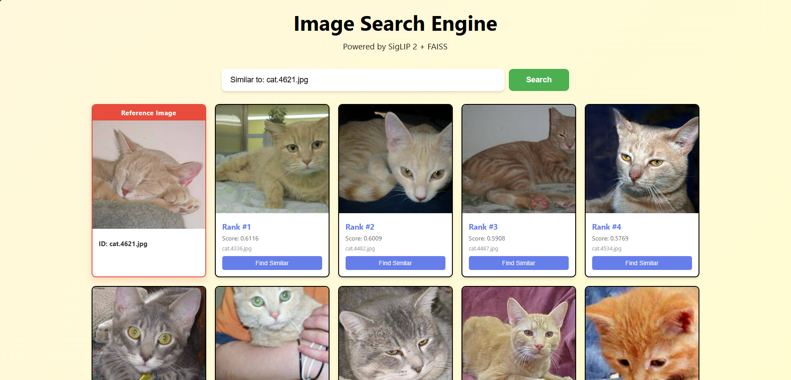

# Multimodal Image Search Engine

Flask-based image search engine using SigLIP 2 for text-to-image search and DINOv3 for visual similarity search.

## Screenshots

### Homepage


### Text Search Results


### Visual Similarity Search


## Setup

1. Install dependencies (Python 3.11+):
```bash
pip install -r requirements.txt
```

2. **Download dataset**: Download the cats images from [Google Drive](https://drive.google.com/file/d/1Ehx9GzasjR576Cpz6oWU2YNzrnnLHb0w/view?usp=sharing), extract the zip file and place images in `dataset/test_set/cats/` directory.

3. Prepare embeddings (run ONCE after adding images, takes ~10-20 min on CPU):
```bash
python prepare_embeddings.py
```

4. Run Flask app:
```bash
python app.py
```

5. Open browser: http://localhost:5000

## Dataset Structure

```
dataset/
└── test_set/
    └── cats/
        ├── your_image_1.jpg
        ├── your_image_2.jpg
        └── ...
```

## Usage

- **Text Search**: Enter queries like "a cute cat", "sleeping kitten", "cat with blue eyes"
- **Visual Search**: Click "Find Similar" on any result to find visually similar images

## Architecture

- **SigLIP 2**: Text-to-image search using multimodal embeddings
- **DINOv3**: Visual similarity search using self-supervised features  
- **FAISS**: Fast similarity search indexing
- **Flask**: Web backend with REST API
